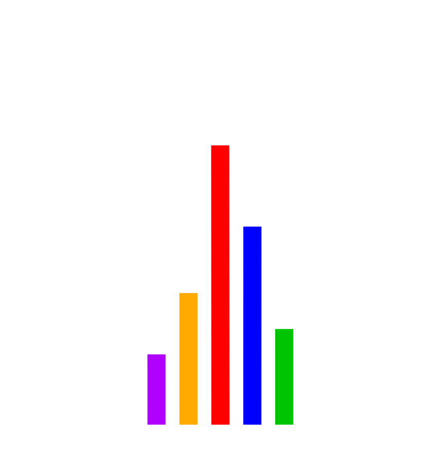

# Electostatica — Spanish Electoral Data Visualization

**Electostatica** is an interactive, browser-based platform for exploring and visualizing Spanish electoral history. From national **Congreso** elections to local **Municipales**, this tool allows users to drill down into results at the autonomous community, province, and municipality levels.

Whether you're a journalist, political analyst, researcher, or simply a curious citizen, Electostatica provides a powerful lens to understand the evolution of Spanish politics.


> _Created by Cayetano Martínez-Muriel. This application was architected and developed with assistance from Google Antigravity._

---

## 🌟 Features

### 📊 Interactive Dashboard
- **Multi-Level Map**: Drill down from **Comunidades Autónomas → Provincias → Municipios** with a single click.
- **Election Summary Table**: View votes, percentages, and seats for all parties.
- **Comparison Bars**: Visually compare results against any previous election.
- **CCAA Seat Grid**: See seat distribution across all autonomous communities at a glance.

### 📈 Tendencias (Historical Trends)
- Track party performance over time with interactive line and area charts.
- Compare vote shares across multiple elections.

### 🗺️ Multimapa (Multi-Map Comparison)
- Display **multiple maps side-by-side** to compare different elections.
- Each map has independent controls for election type and date.
- **Export to SVG**: Download individual maps or a combined multi-map image.

### 🏛️ Predictor (Coalition Builder)
- Adjust seat counts with sliders to simulate hypothetical election outcomes.
- **Coalition Calculator**: Build coalitions and see if they reach the **176-seat majority**.
- **Save & Load Scenarios**: Store your predictions locally for future reference.
- Supports both Congreso (350 seats) and Municipales.

### 📱 Mobile-First Responsive Design
- Fully optimized for **iPhone, iPad, and Android** devices.
- Touch-friendly controls and gestures.
- Adaptive layouts that work on any screen size.

---

## 🛠️ Tech Stack

| Category        | Technology                                      |
|-----------------|-------------------------------------------------|
| **Frontend**    | React 19, Vite 7, D3.js 7                       |
| **Mapping**     | D3-Geo + TopoJSON                               |
| **Styling**     | Vanilla CSS with CSS Variables (Glassmorphism) |
| **Backend**     | Express 5 (Node.js)                             |
| **Data Format** | JSON (processed from official CSV sources)     |
| **Icons**       | Lucide React                                    |
| **PDF Export**  | jsPDF, html2canvas                              |

---

## 🚀 Getting Started

### Prerequisites
- **Node.js** (v18 or later recommended)
- **npm** (v9 or later)

### Installation

```bash
# Clone the repository
git clone https://github.com/yourusername/electostatica.git
cd electostatica

# Install dependencies
npm install
```

### Running Locally

**Development Mode** (with hot-reload):
```bash
# Start the backend API server (port 5001)
node server/index.js &

# Start the Vite development server (port 3000)
npm run dev
```

Open your browser to `http://localhost:3000`.

**Production Build**:
```bash
npm run build
npm run preview
```

---

## 📁 Project Structure

```
/electostatica
├── /api                    # Vercel serverless functions
├── /data
│   ├── /geo                # TopoJSON map files (communities, provinces, municipalities)
│   └── /processed          # Processed election result JSONs
├── /public
│   ├── logo_horiz.png      # Horizontal logo
│   └── logo_iso.png        # Isometric logo (loading screen)
├── /scripts
│   ├── parser.py           # Convert raw election data to JSON
│   └── batch_parser.py     # Batch processing script
├── /server
│   └── index.js            # Express API for local development
├── /src
│   ├── /components
│   │   ├── /Charts         # ElectionSummary, CCAASeatGrid, TimeHistory, SeatBar
│   │   ├── /Controls       # ElectionControls
│   │   ├── /Map            # SpanishMap (D3)
│   │   ├── CoalitionBuilder.jsx
│   │   ├── LoadingScreen.jsx
│   │   ├── MultiMapView.jsx
│   │   ├── Predictor.jsx
│   │   └── SavedPredictions.jsx
│   ├── /context            # LanguageContext (i18n)
│   ├── /utils              # partyUtils, regionData
│   ├── App.jsx             # Main application component
│   └── index.css           # Global styles
├── index.html              # Vite entry point
├── package.json
├── vite.config.js
└── vercel.json             # Vercel deployment configuration
```

---

## 📊 Data Sources

All election data is sourced from official public records provided by the **Spanish Ministry of the Interior** (Ministerio del Interior).

### Adding New Elections

1. Place raw election data in a source folder.
2. Run the parser script:
   ```bash
   python scripts/parser.py /path/to/raw/data
   ```
3. The processed JSON will be saved to `/data/processed/`.
4. Restart the server to load the new data.

**File Naming Convention:**
- `congreso_YYYY_MM.json` — General elections
- `municipales_YYYY_MM.json` — Municipal elections

---

## 🎨 Party Configuration

Party colors, aliases, and normalization rules are defined in:

**`src/utils/partyUtils.js`**

To add or modify a party:
1. Edit `PARTY_CONFIG` for colors and display names.
2. Add regex rules for name variations (e.g., `"PSE-EE"` → `"PSOE"`).
3. Add aliases for alternative spellings.

---

## 🌐 API Endpoints

| Endpoint               | Description                          |
|------------------------|--------------------------------------|
| `GET /api/elections`   | List all available elections         |
| `GET /api/results/:id` | Get detailed results for an election |
| `GET /api/history`     | Historical data for trend charts     |

---

## 📱 Responsive Breakpoints

| Breakpoint   | Target Device           |
|--------------|-------------------------|
| ≤ 1024px     | Tablet (single-column)  |
| ≤ 768px      | Mobile                  |
| ≤ 480px      | Small mobile            |
| ≤ 375px      | iPhone SE and similar   |

---

## 🚢 Deployment

### Vercel (Recommended)

The project is pre-configured for Vercel with `vercel.json`. Simply connect your GitHub repository to Vercel and it will deploy automatically.

### Manual Deployment

```bash
npm run build
```

The production-ready files will be in the `/dist` folder. Serve them with any static file server (Nginx, Apache, Cloudflare Pages, etc.).

---

## 📄 License

This project is licensed under the **MIT License**. See the [LICENSE](LICENSE) file for details.

---

## 🙏 Acknowledgments

- **D3.js** community for the incredible mapping and visualization library.
- **Instituto Nacional de Estadística (INE)** and **Ministerio del Interior** for providing public electoral data.
- **Google Gemini** for development assistance.

---

## ⚠️ Known Limitations

- **Municipality-level data** can be very large (~70MB TopoJSON). Loading times may vary.
- **Historical data coverage** depends on available official sources.
- **Party normalization** is a complex task; some smaller regional parties may not be perfectly categorized.

---

## 🧑‍💻 Developer Guide

### Key Components

| Component | File | Description |
|-----------|------|-------------|
| **SpanishMap** | `src/components/Map/SpanishMap.jsx` | D3 map with level controls & zoom |
| **ElectionSummary** | `src/components/Charts/ElectionSummary.jsx` | Results table with comparison bars |
| **CCAASeatGrid** | `src/components/Charts/CCAASeatGrid.jsx` | CCAA seat distribution grid |
| **TimeHistory** | `src/components/Charts/TimeHistory.jsx` | Historical trends chart |
| **Predictor** | `src/components/Predictor.jsx` | Coalition builder & scenario manager |
| **MultiMapView** | `src/components/MultiMapView.jsx` | Multi-map comparison tool |

### Data Normalization

Party handling is managed in **`src/utils/partyUtils.js`**:

- **`normalizeParty(name)`**: Standardizes party names across elections
- **`PARTY_CONFIG`**: Colors and aliases per party
- **`REGEX_RULES`**: Pattern matching for variations (e.g., `"PSE-EE"` → `"PSOE"`)
- **Dot Stripping**: `"B.N.G."` becomes `"BNG"`

### File Naming Conventions

| Type | Convention | Example |
|------|------------|---------|
| Components | PascalCase | `SpanishMap.jsx` |
| Utils | camelCase | `partyUtils.js` |
| CSS classes | kebab-case | `election-summary` |
| Data files | snake_case | `congreso_2023_07.json` |

---

## 📬 Contact

For questions, suggestions, or contributions, please open an issue on GitHub or contact the author directly.

---

<p align="center">
  
  <br>
  <em>Made with ❤️ for democracy and data transparency</em>
</p>
